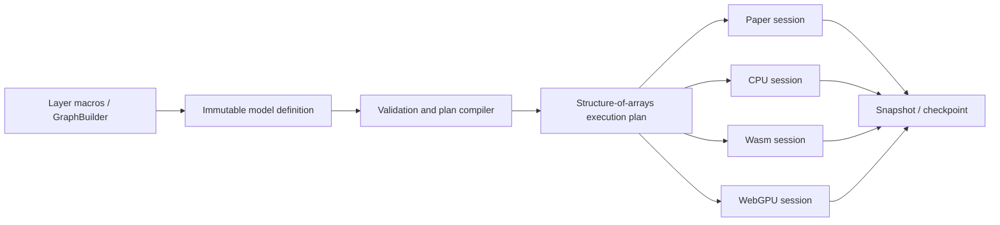

# Architecture

Synaptic v2 separates portable meaning from disposable execution machinery.



## Portable layers

### Model definition

A `ModelDefinition` contains:

- versioned format and LSTM-g algorithm IDs;
- precision;
- units and explicit stages;
- connections and explicit current/previous-step delays;
- gates and their delays;
- parameters, initializers, and trainability;
- input/output ports and optional metadata.

It contains no learned values, mutable state, devices, shader modules, Wasm
instances, generated functions, or backend caches.

### Snapshot

A `ModelSnapshot` combines a definition with its parameter buffer. Parameters
are independent records: multiple connections may reference the same parameter
ID. This is the basis for deterministic tied-weight reductions and future
convolution macros.

### Checkpoint

A `ModelCheckpoint` adds:

- current state and activation;
- previous activation and derivatives;
- eligibility and extended eligibility traces;
- projected, gated, and total errors;
- optional named optimizer buffers;
- logical step, PRNG seed, and PRNG counter.

Every backend can restore a compatible checkpoint. Runtime-owned compiled
objects are deliberately excluded.

## Semantic schedule

Stages are part of the model contract, not an optimizer guess.

- Units in one stage are semantically parallel.
- A zero-delay connection reads the current step and must respect stage order.
- A one-delay connection reads the previous activation.
- Recurrent self-connections are delayed.
- A gate independently declares whether it reads the current or previous step.
- One successful forward or training call increments the logical step once.

The compiler validates these rules and lowers the graph into compact typed
arrays:

- stage offsets and unit order;
- incoming/outgoing adjacency;
- connection source, target, parameter, delay, and gater;
- compact gated-target indexes;
- compact extended-trace indexes;
- input/output slots;
- recognized specializations such as dense stages.

This plan is semantic intermediate representation. It does not prescribe a
shared target-language statement AST; each backend lowers it for its own memory,
scheduling, and synchronization model.

## Training

The Paper backend is organized around equations 14–24 of Monner and Reggia's
generalized LSTM-like algorithm. CPU, Wasm, and WebGPU implement the same
observable boundaries:

1. preserve the previous activation;
2. evaluate stages;
3. update eligibility and extended traces;
4. calculate projected and gated responsibility in reverse stage order;
5. reduce per-connection gradients into shared parameters;
6. apply one online parameter update.

Trainable self-connections are rejected because the implemented LSTM-g
semantics treat recurrent self-connections as fixed memory coefficients.

## Backend boundary

Backends implement:

```ts
interface Backend {
  readonly id: string;
  inspect(plan: ExecutionPlan, options?: CompileOptions): SupportReport;
  compile(
    plan: ExecutionPlan,
    snapshot: ModelSnapshot,
    options?: CompileOptions,
  ): Promise<Session>;
}
```

`inspect` makes support decisions explainable. A session owns all mutable
backend resources and exposes the same async lifecycle: `forward`, `trainStep`,
`resetState`, `restore`, `snapshot`, `checkpoint`, and `dispose`.

## Determinism and precision

The portable production precision is `f32`. Paper additionally supports `f64`
for diagnostics. Initialization uses a specified counter PRNG rather than
`Math.random`. Artifact decoding is explicitly little-endian.

Cross-backend tests compare outputs, loss, parameters, recurrent values, traces,
and errors over feed-forward, recurrent, and shared-parameter fixtures.

## Package boundaries

`@synaptic/core` has no backend dependency. Layers depend only on core.
Production backends depend on core, except WebGPU also owns its ordered Wasm/CPU
fallbacks. The `synaptic` facade assembles the user-facing defaults. Legacy
conversion is isolated in `@synaptic/compat-v1`.
