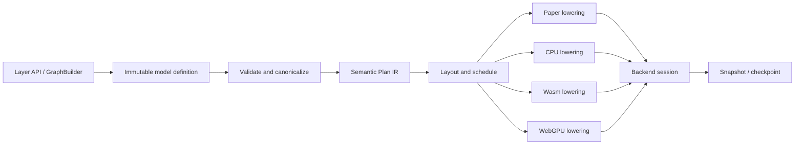

# Synaptic v2 architecture proposal

Status: implemented baseline; retained as the research and decision record

Implementation summary: [v2 implementation status](implementation-status.md)

The final baseline omits ASM.js, keeps Wasm explicit rather than auto-selecting
it until specialization wins benchmarks, and implements portable checkpoint
restoration across backends.

Branch: `v2`

Research baseline:

- Synaptic `master` at `58bf2d4`
- local `synaptic2` `main` at `2a98a30`
- local `synaptic2` `wasm2` at `b849b9b`
- Monner and Reggia, *A generalized LSTM-like training algorithm for second-order recurrent neural networks* (`synaptic2/nn2012.pdf`)

## Recommendation

Synaptic v2 should keep the part that makes Synaptic distinctive: a declarative,
architecture-free graph of units, weighted connections, and connection gates,
trained with the generalized LSTM (LSTM-g) equations.

It should replace the old mutable object graph with four explicit layers:

1. an immutable, serializable **model definition**;
2. versioned parameters and optional checkpoint state;
3. a backend-independent, compact **execution plan** produced by a compiler;
4. an asynchronous, backend-owned **session**.

The initial backend order should be:

1. **Paper** - literal, inspectable equations and the correctness oracle;
2. **CPU** - portable TypeScript over typed arrays;
3. **Wasm** - the default accelerated CPU path;
4. **WebGPU** - the throughput path, with CPU/Wasm fallback.

The public API should be TypeScript-first and asynchronous across all backends.
The serialized artifact must never contain a GPU device, Wasm instance, compiled
function, or other runtime-owned object.

## What the archaeology says

### Synaptic v1

The current repository already contains three ideas worth preserving:

- The `Neuron`/`Connection`/`Layer` API can describe unusual first- and
  second-order recurrent networks, not just a fixed catalog of layers.
- The optimizer compiles object-oriented neuron behavior into a flat numeric
  heap and generated statements.
- `Network.toJSON()`/`fromJSON()` and optimized/unoptimized equivalence tests
  establish portability and cross-implementation parity as product behavior.

The limitations are structural:

- topology, trainable parameters, recurrent state, traces, derived indexes, and
  execution code are mixed together;
- activation order is implicit in JavaScript iteration order;
- the generated code path is embedded in `Network` and `Neuron`;
- compilation uses dynamic JavaScript source;
- object graphs and sparse JavaScript dictionaries make memory use and transfer
  to Wasm/WebGPU expensive;
- synchronous APIs cannot accurately represent GPU work.

### `synaptic2` main

The unfinished second repository made the right conceptual split:

- `Engine` owns topology and values but no math;
- multiple backends implement the same execution contract;
- topology can be serialized and cloned;
- layers build the graph rather than implementing their own math;
- shared golden fixtures compare activation and propagation across backends.

Its `Paper` backend is especially valuable. It maps equations 14-24 from the
paper directly into code and should be treated as an executable specification.

The representation is not suitable as the v2 foundation, however:

- arrays-of-arrays encode a conceptually sparse graph with quadratic address
  spaces;
- `projectionSet` and `gateSet` use numeric unit ID comparisons as a proxy for
  execution order;
- the JSON includes transient and derivable runtime values;
- topology, weights, recurrent context, traces, and trainer state are one blob;
- activation functions and layer experiments contain unfinished derivatives
  and correctness bugs;
- the two-pass `init`/`reverseInit` protocol exists mainly so an LSTM output
  gate can discover connections created by later layers.

The convolution experiment also highlights a missing abstraction: connections
have independent weights, so receptive-field connectivity does not provide
modern convolutional weight sharing.

### `synaptic2` `wasm2`

The `wasm2` branch is relevant prior art. It already explored:

- a compiler-owned flat heap;
- a shared code-generation AST;
- a Binaryen-based per-model Wasm emitter;
- asynchronous model building;
- the same backend test suite across implementations.

That validates the compile-once/session model. The part not to carry forward is
the assumption that one statement AST should directly serve every backend.
Wasm, scalar JavaScript, and WebGPU have different scheduling, reduction,
memory, and synchronization requirements. They should share a semantic plan,
then lower separately.

## The semantic contract

Backends can only agree if v2 specifies behavior more precisely than v1 did.

### Units, connections, gates, and parameters

A model definition contains:

```ts
type UnitId = number;
type ConnectionId = number;
type ParameterId = number;
type StageId = number;

interface UnitSpec {
  id: UnitId;
  stage: StageId;
  activation: ActivationId;
  label?: string;
}

interface ConnectionSpec {
  id: ConnectionId;
  from: UnitId;
  to: UnitId;
  parameter: ParameterId;
  delay: 0 | 1;
}

interface GateSpec {
  connection: ConnectionId;
  gater: UnitId;
  delay: 0 | 1;
}

interface ParameterSpec {
  id: ParameterId;
  trainable: boolean;
  initializer?: InitializerSpec;
}
```

An ungated connection has no `GateSpec`. Multiple connections may reference
one `ParameterId`; this makes weight tying and true convolution possible
without changing the basic unit/connection/gate model.

Bias should be represented canonically as a weighted connection from a
constant-one unit. This keeps Paper semantics literal while allowing compilers
to fold it into a bias array.

Activation functions, initializers, costs, and optimizers must use serializable
IDs plus versioned options. User-provided JavaScript functions are allowed only
as CPU-local extensions and make a model explicitly non-portable.

### Time and ordering

Each `forward()` call advances one logical time step.

- Units in a stage are evaluated in parallel.
- A zero-delay connection reads the sending unit's value from the current time
  step.
- A one-delay connection reads the previous time step.
- Zero-delay connections must form an acyclic stage graph.
- Self-connections are delayed and retain the previous state.
- A gate's delay says whether its current or previous activation controls the
  connection.

This removes the accidental "some earlier units in this array have new values,
some later units still have old values" behavior and gives CPU, Wasm, and GPU
the same deterministic schedule. A v1 importer can reproduce old ordering by
assigning explicit stages, or report networks whose serial intra-layer behavior
cannot be parallelized safely.

### Precision

The portable production precision is `f32`.

- WebGPU/WGSL has `f32` and optionally `f16`, but no runtime `f64` scalar type.
- CPU and Paper may offer `f64` for diagnostics.
- Backend parity tests run Paper in an `f32` mode that rounds at the same
  semantic boundaries as production backends.
- `f16` is a future optional accelerator, never a silent downgrade.

Random behavior must use a specified counter-based PRNG. A checkpoint stores
the seed, counter, and logical step. Dropout masks and initializers must not
depend on backend-specific `Math.random()` or shader randomness.

## Model, snapshot, checkpoint, and cache

Serialization should distinguish four artifacts:

| Artifact | Contents | Portable |
| --- | --- | --- |
| Model definition | topology, stages, named operations, inputs/outputs, metadata | yes |
| Model snapshot | model definition plus trainable parameter values | yes |
| Checkpoint | snapshot plus recurrent state, eligibility traces, optimizer state, PRNG state, and step | yes, when the target backend supports all features |
| Compiled cache | lowered plan, WGSL/pipelines, or Wasm module | no; optional and disposable |

The canonical persisted form should be a small JSON manifest plus
little-endian binary sidecars. JSON contains IDs, shapes, offsets, dtypes,
versions, and integrity hashes. Numeric arrays stay binary instead of becoming
large JSON number lists or base64 strings.

Every manifest contains at least:

```ts
interface SynapticArtifactManifest {
  format: "synaptic";
  formatVersion: number;
  algorithm: "lstm-g";
  algorithmVersion: number;
  precision: "f32" | "f64";
  topology: TopologyManifest;
  buffers: BufferManifest[];
  metadata?: Record<string, unknown>;
}
```

Deserialization validates versions, IDs, offsets, lengths, finite values,
acyclic zero-delay stages, supported activation IDs, and resource limits before
allocating backend resources. Migrations operate on the portable artifact, not
on compiled caches.

## Authoring API

The public authoring model should have two levels.

### Layer composition

The common path is declarative:

```ts
const model = sequential(
  input({ size: 2 }),
  lstm({ units: 8, peepholes: true }),
  dense({ units: 1, activation: "logistic" })
);
```

Layers are macros over the graph builder. They do not execute math.

Instead of `reverseInit`, a layer returns a port:

```ts
interface Port {
  units: readonly UnitId[];
  shape: readonly number[];
  outboundGate?: readonly UnitId[];
}
```

When a later layer connects from a port with `outboundGate`, the builder adds
the gate relationships. The graph remains mutable until `build()`, so custom
builders can also add gates after connections without a special reverse phase.

### Low-level graph construction

The distinctive Synaptic path remains available:

```ts
const graph = new GraphBuilder();
const input = graph.units(2, { activation: "identity" });
const cells = graph.units(4, { activation: "tanh" });
const gates = graph.units(4, { activation: "logistic" });

const incoming = graph.connect(input, cells, "all-to-all");
graph.gate(gates, incoming, "one-to-one-target");

const model = graph.build({ inputs: input, outputs: cells });
```

`build()` freezes and validates the definition. There are no backend objects in
the builder.

## Compiler and runtime architecture



The semantic Plan IR contains operations such as:

- snapshot previous-step values;
- load inputs;
- evaluate a stage;
- update eligibility traces;
- update extended eligibility traces;
- calculate projected and gated error responsibility;
- update or accumulate parameters;
- reset recurrent context.

It describes dependencies and numeric intent, not target-language statements.
Each backend decides whether to interpret, specialize, fuse, or split those
operations.

The runtime contract should look approximately like:

```ts
interface Backend {
  readonly id: string;
  inspect(plan: ExecutionPlan, options: CompileOptions): SupportReport;
  compile(
    plan: ExecutionPlan,
    parameters: ParameterData,
    options: CompileOptions
  ): Promise<Session>;
}

interface Session {
  readonly backend: string;
  forward(input: TensorLike, options?: ForwardOptions): Promise<Tensor>;
  trainStep(batch: TrainingBatch, options?: TrainStepOptions): Promise<Metrics>;
  resetState(): Promise<void>;
  snapshot(): Promise<ModelSnapshot>;
  checkpoint(): Promise<ModelCheckpoint>;
  dispose(): void;
}
```

`SupportReport` explains unsupported activations, precision, graph features,
limits, or training operations. `backend: "auto"` evaluates those reports and
uses a declared fallback order. Explicit backend selection fails clearly rather
than silently changing semantics.

The `Trainer` owns dataset iteration, batching, stopping criteria, logging,
cancellation, and validation. The session owns backend-resident forward and
training steps. This avoids a GPU readback and JavaScript callback per unit or
weight.

## Shared flat layout

The compiled portable plan should use structure-of-arrays buffers with an
explicit byte layout:

- `unitActivationFunction: Uint32Array`
- `unitStage: Uint32Array`
- `stageOffsets: Uint32Array`
- `stageUnits: Uint32Array`
- `incomingOffsets: Uint32Array`
- `incomingSources: Uint32Array`
- `incomingConnectionIds: Uint32Array`
- `outgoingOffsets: Uint32Array`
- `outgoingTargets: Uint32Array`
- `connectionParameter: Uint32Array`
- `connectionGater: Int32Array` (`-1` means ungated)
- `connectionDelay: Uint32Array`
- `gateDelay: Uint32Array`
- compact indexes for the existing Paper "big parenthesis" term;
- compact `(input connection, gated target)` indexes for extended traces.

Mutable numeric buffers include:

- parameters;
- current and previous state/activation;
- derivatives;
- projected, gated, and total error responsibility;
- one eligibility trace per applicable weighted connection;
- only the required extended eligibility traces;
- optimizer slots.

This schema is shared conceptually by `Float32Array`, Wasm linear memory, and
WGSL storage buffers. Host/WGSL offsets and strides are generated from one
layout description and tested together.

## Backend plans

### Paper

Purpose: semantics, education, debugging, and golden results.

- Direct, scalar TypeScript closely mirroring equations 14-24.
- No fusion or generated code.
- Named intermediate values and optional per-equation tracing.
- `f64` diagnostic mode and `f32` conformance mode.
- Small graphs only; never selected automatically for performance.

The Paper backend is the authority when another backend disagrees. It should be
ported first from `synaptic2`, with existing spelling and derivative bugs fixed
under new golden tests.

### CPU

Purpose: universal fallback and easiest production debugger.

- Strict TypeScript over the compact typed-array plan.
- No object allocation inside a step.
- A scalar generic path must support every portable graph feature.
- Recognized dense motifs may use cache-friendly specialized loops.
- Optional execution in a Worker belongs in the session host, not in graph
  semantics.

CPU is also the fallback for very small networks where GPU startup, dispatch,
and readback dominate useful work.

### Wasm

Purpose: accelerated, predictable CPU execution in browsers and Node.

For v2.0, use a precompiled Wasm runtime that consumes the same compact plan
and heap. AssemblyScript is a reasonable first implementation language because
it keeps TypeScript-like syntax, but it must be treated as a separate,
restricted language rather than code shared directly with TypeScript.

Start with a single-threaded `f32` scalar build, then add:

- a SIMD build for recognized dense loops;
- a threaded build only as an explicit variant, because browser threads require
  `SharedArrayBuffer` and cross-origin isolation headers;
- feature detection and selection before instantiation.

Do not begin with per-model Wasm generation. The old `wasm2` branch proves it
can work, but a static runtime is easier to validate, cache, deploy under CSP,
and debug. Model-specialized Wasm can be reconsidered after profiling shows a
real gap.

### WebGPU

Purpose: large batched models and long-running training where data remains on
the device.

The baseline uses only core `f32`, storage buffers, and conservative workgroup
sizes. Optional `f16`, timestamp queries, subgroups, and raised limits are
separate capability-gated paths.

A generic correctness path can dispatch one invocation per unit for a stage,
with each invocation walking compact incoming ranges. Later optimized paths
can dispatch over edges or recognized motifs. Dependent global phases use
separate compute passes; workgroup barriers cannot synchronize the whole
network.

An illustrative step is:

```text
host input upload
  -> snapshot/swap previous state
  -> for each forward stage:
       activation
       eligibility and extended eligibility traces
  -> optional output readback
  -> for each reverse stage:
       error responsibility
       parameter-gradient/update
  -> occasional bounded metrics readback
```

Persistent parameters, state, traces, plans, bind groups, and pipelines stay on
the GPU. Training does not read all weights or activations back each step.

The backend must:

- request only required features and limits;
- calculate every WGSL/host byte offset and stride explicitly;
- guard over-dispatched invocations;
- report shader compilation and validation errors;
- handle device loss as session loss or rebuild from the portable snapshot;
- destroy owned buffers and listeners;
- fall back to Wasm/CPU when WebGPU is unavailable or the graph is too small.

The first WebGPU milestone should be forward parity, followed by recurrent
multi-step parity, then training. Trying to implement all three at once would
hide scheduling and layout defects.

## Package layout

A workspace keeps optional heavy runtimes out of the core bundle:

```text
packages/
  core/                 model, builder, artifact schema, validation, Plan IR
  layers/               dense, LSTM, perceptron and other graph macros
  backend-paper/        equation-aligned reference backend
  backend-cpu/          typed-array backend
  backend-wasm/         host adapter plus Wasm binaries
  backend-webgpu/       WGSL, layout generator, device/session lifecycle
  compat-v1/            v1 and synaptic2 artifact import
  conformance/          shared backend fixtures and test harness
  synaptic/             ergonomic public facade and auto selection
```

The root `synaptic` package re-exports the normal authoring API. Backends can
also be imported explicitly so bundlers do not pull WebGPU or Wasm into a
CPU-only application.

## Scope for v2.0

The first release should not try to compete with general tensor frameworks.
Its scope should be:

- arbitrary LSTM-g unit/connection/gate graphs;
- Perceptron, LSTM, Liquid, and Hopfield graph macros;
- forward execution and online training;
- portable snapshots and checkpoints;
- Paper, CPU, Wasm, and WebGPU backends;
- a v1 JSON importer.

Convolution, pooling, softmax, and dropout should only graduate after their
semantics, derivatives, weight sharing, batching, and cross-backend tests are
specified. The unfinished `synaptic2` versions should be research input, not
ported API promises.

## Conformance and testing

Every backend must pass the same tests generated from portable artifacts.

Required layers of testing:

1. **Paper equation tests** - equations 14-24, including the intermediate
   "big parenthesis" term.
2. **Topology tests** - stages, delays, gates, invalid cycles, parameter
   sharing, and deterministic serialization.
3. **Single-step parity** - all mutable values after one activation and one
   propagation.
4. **Sequence parity** - recurrent state and traces over multiple time steps.
5. **Training parity** - weight deltas and convergence on AND, OR, XOR, the
   timing task, and Distracted Sequence Recall.
6. **Artifact round trips** - definition, snapshot, and checkpoint.
7. **Precision tests** - exact where specified; documented tolerances for
   transcendental functions and parallel reductions.
8. **Backend lifecycle tests** - failed compilation, fallback, cancellation,
   device loss, disposal, and rebuild.
9. **Performance tests** - startup, warm execution, memory, transfer bytes,
   steps/second, and readback separately.

The existing `synaptic2` LSTM fixtures should become the first migration
fixtures. New golden artifacts should include small graphs specifically chosen
to exercise self-gating, cross-gating, delayed edges, peepholes, and a unit
that both projects and gates.

## Migration

`compat-v1` should:

- parse current Synaptic `Network.toJSON()` output;
- map neurons, squash functions, connections, self-connections, biases, and
  gaters into the new model definition;
- assign explicit stages/delays from the legacy activation order;
- import current weights and optional recurrent context;
- warn when a legacy graph depends on serial order within a layer;
- emit a normal versioned v2 snapshot.

A second importer can recognize `synaptic2` engine JSON, including its existing
`elegibilityTrace` spelling, and split it into definition, parameters, and
checkpoint state.

The v1 API itself should not be emulated inside the new core. A thin adapter can
be offered for migration, but `Neuron` objects must not leak into compiled
sessions.

## Delivery sequence

### Phase 0 - contract

- Establish the TypeScript workspace and strict build/test tooling.
- Write the versioned artifact schema and stage/delay semantics.
- Import representative v1 and `synaptic2` fixtures.
- Freeze the backend/session interfaces.

Exit criterion: deterministic artifact round trips and topology validation.

### Phase 1 - reference

- Port and correct Paper.
- Implement compact plan construction and the CPU interpreter.
- Add single-step and recurrent cross-backend conformance.

Exit criterion: Paper and CPU agree in `f32` mode across all core graph
features and legacy fixtures.

### Phase 2 - Wasm

- Add the precompiled single-threaded Wasm runtime.
- Add feature-selected SIMD after scalar parity.
- Benchmark Wasm vs CPU to define `auto` thresholds.

Exit criterion: Wasm passes the same training suite and beats CPU on the
workloads for which it is selected.

### Phase 3 - WebGPU forward

- Implement capability negotiation, shared buffer layout, forward stages,
  recurrent ping-pong state, bounded output readback, and lifecycle handling.

Exit criterion: multi-step forward parity on at least Chromium, Safari/WebKit,
and Firefox configurations in the supported matrix, plus tested fallback.

### Phase 4 - WebGPU training

- Add trace updates, reverse stages, weight updates, batching, checkpoints, and
  periodic metrics.

Exit criterion: training parity and useful speedups without per-step full
readback.

### Phase 5 - specialization and compatibility

- Recognize and fuse common graph motifs.
- Specify shared parameters before adding true convolution.
- Expand v1 compatibility and documentation.

## Decisions to make before implementation

The following defaults are recommended:

| Question | Recommended default |
| --- | --- |
| Public calls | asynchronous |
| Portable precision | `f32` |
| Unsupported WebGPU | Wasm, then CPU fallback |
| Training algorithm in v2.0 | LSTM-g online training |
| Graph scheduling | explicit parallel stages and delays |
| Serialization | versioned JSON manifest plus binary buffers |
| Randomness | specified counter-based PRNG |
| Wasm implementation | precompiled AssemblyScript runtime first |
| Wasm threading | optional later build, never required |
| CNN-style layers | deferred until shared parameters and reductions are real |

## Current platform research

- WebGPU is a W3C Candidate Recommendation Draft as of March 2026, and its
  editor's draft defines explicit device capabilities, limits, asynchronous
  errors, and buffer-binding constraints:
  [W3C publication history](https://www.w3.org/standards/history/webgpu/),
  [WebGPU specification](https://gpuweb.github.io/gpuweb/).
- WGSL's concrete floating-point types are `f32` and optional `f16`; its
  host-shareable layouts require exact alignment and stride calculations:
  [WGSL specification](https://gpuweb.github.io/gpuweb/wgsl/).
- Safari 26 added WebGPU outside WebXR, while Firefox has been expanding
  default platform enablement. The implementation matrix still requires
  runtime feature detection and fallback:
  [WebKit Safari 26 notes](https://webkit.org/blog/17333/webkit-features-in-safari-26-0/),
  [Mozilla macOS enablement record](https://bugzilla.mozilla.org/show_bug.cgi?id=1992212).
- WebAssembly 3.0 is a portable low-level execution format. SIMD and threads
  are broadly implemented, but browser threads require cross-origin isolation:
  [WebAssembly 3.0](https://webassembly.github.io/spec/core/),
  [feature status](https://webassembly.org/features/),
  [Emscripten SIMD](https://emscripten.org/docs/porting/simd.html),
  [Emscripten pthreads](https://emscripten.org/docs/porting/pthreads.html).
- AssemblyScript is TypeScript-like rather than TypeScript-compatible, so it
  should share schemas and tests with the host without pretending to share all
  source:
  [AssemblyScript concepts](https://www.assemblyscript.org/concepts.html).
- ONNX Runtime's execution-provider architecture and WebGPU buffer/session
  lifecycle provide a current precedent for capability-based backends,
  persistent device data, fallback, and graph capture:
  [execution providers](https://onnxruntime.ai/docs/execution-providers/),
  [WebGPU provider](https://onnxruntime.ai/docs/execution-providers/WebGPU-ExecutionProvider.html).

## Bottom line

The central v2 design should not be separate implementations of `Network`. It
should be one precisely specified, serializable LSTM-g model; one compiler
that turns it into an explicit plan; and backend sessions that own only
execution.

That preserves the intent of both old repositories while giving WebGPU and
Wasm the flat memory, deterministic scheduling, asynchronous lifecycle, and
capability negotiation they require.
